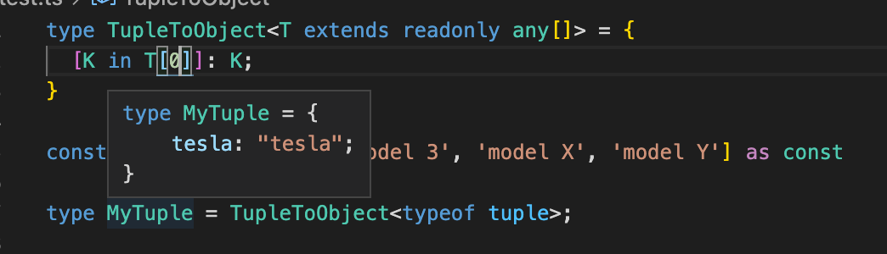

# Tuple to Object

> [문제 링크](https://github.com/type-challenges/type-challenges/blob/main/questions/00011-easy-tuple-to-object/README.ko.md)

# 풀이

```ts
const tuple = ['tesla', 'model 3', 'model X', 'model Y'] as const

type TupleToObject<T extends readonly any[]> = {
  [K in T[number]]: K;
}

type result = TupleToObject<typeof tuple> // expected { tesla: 'tesla', 'model 3': 'model 3', 'model X': 'model X', 'model Y': 'model Y'}
```



위와 같이 `T[index]` 를 넣게되면 해당하는 인덱스의 튜플 값만 반환.
`T[number]`로 튜플 요소의 타입을 유추할 수 있다.
