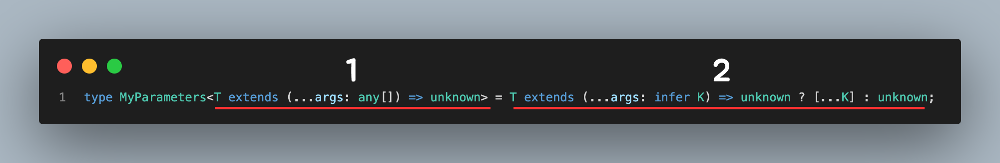

# Parameters

> [문제 링크](https://github.com/type-challenges/type-challenges/blob/main/questions/03312-easy-parameters/README.ko.md)

# 풀이

```ts
type MyParameters<T extends (...args: any[]) => unknown> = T extends (...args: infer K) => unknown ? [...K] : unknown;
```

해당 문제는 크게 두 개로 나눠서 보면 된다.
기억해야 하는 것은 `extends`가 **조건문**이라고 생각하면 조금 쉽게 다가갈 수 있다.



### 1.

우선 `<T extends (...args: any[]) => unknown>`를 잘 살펴보면
`extends`를 기준으로 두 개로 나눌 수 있다.
`T`와 `(...args: any[]) => unknown`.
위의 뜻은 `T`가 해당 조건을 만족하냐? 를 묻는 것.
그래서 `T`가 함수인지를 먼저 묻고있다.

### 2.

그 뒤 타입 선언문 `T extends (...args: infer K) => unknown ? [...K] : unknown` 을 잘 보면 **삼항 연산자** 로 되어있는 것을 볼 수 있다.
`조건 ? true : false`를 생각하고 보면 쉽게 볼 수 있다.
우리가 조건을 `extends`로 만든다고 했으니 `T extends (...args: infer K) => unknown`는 바로 알 수 있다.
`T`가 함수인지 한번 더 확인을 하고있다. 하지만 요기서 중요한 것은 이게 아니라, `...args: infer K`에 있다.
인자로 가져온 값들을 임시변수 `K`를 가져오는 것이 핵심. 그래서 함수가 맞으면 `[...K]`를 통해서 그대로 타입을 반환한다. (왜냐하면 인자로 `typeof Function`을 넘겨줌)
`T`가 함수가 아니면 바로 `unknown`을 반환한다.

### 추가.

이 문제가 사실 **T가 함수인지?** 를 묻는 조건이 두 번 들어가서, 맨 처음 조건을 빼도 정답이 된다.

```ts
// 맨 처음 조건을 빼도 정답이 된다.
type MyParameters<T> = T extends (...args: infer K) => unknown ? [...K] : unknown;
```
